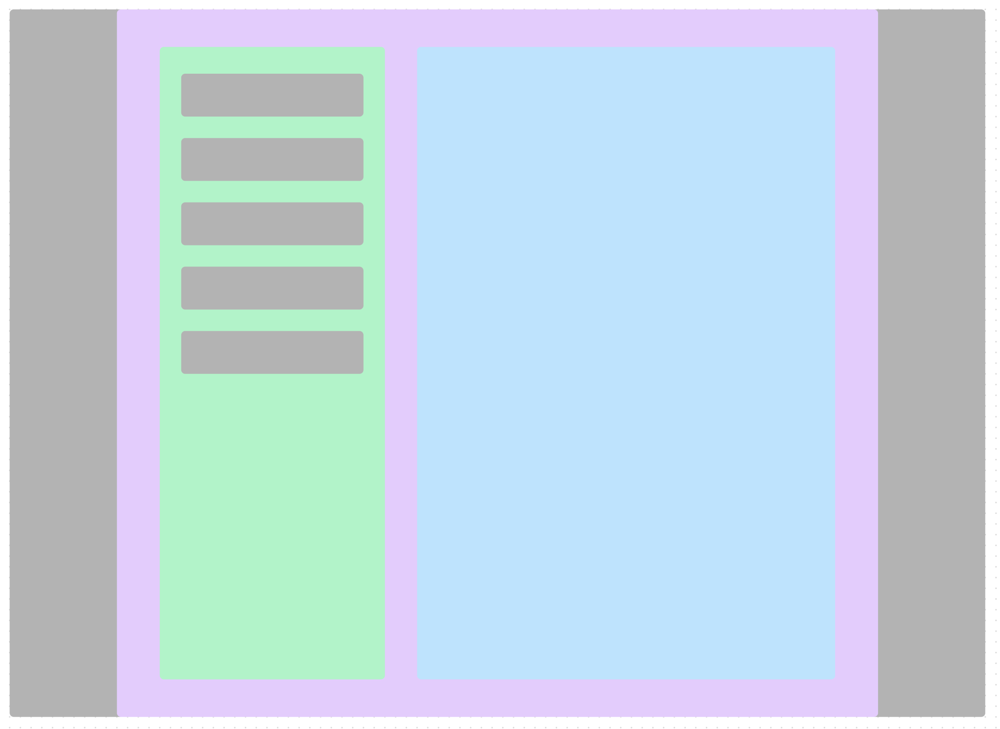
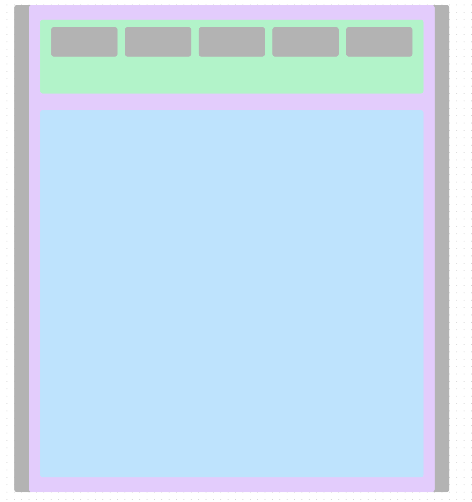
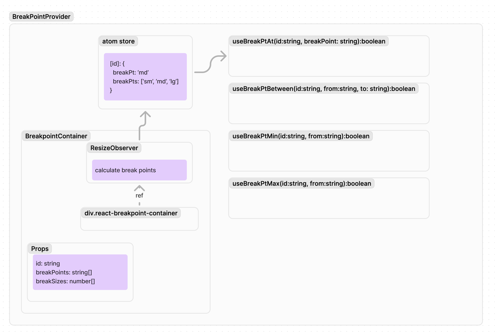
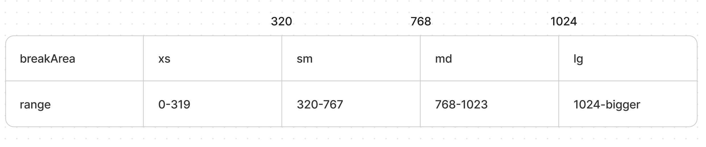

# container-breakpoints

In the concept of responsive design, we use @media queries. 
when the screen size is changed, the UI layout or contents can be changed.
But now we have @container queries which we can control each components or widgets more flexible.

We can use CSS to manage the breakpoints in the container level.
But If you want to manage its information in the javascript level, 
it becomes a little challenge to organize CSS/Components as a managable size.

We have ResizeObserver to detect the size of the container. 
And This library started from there.

## Concept 

Let's say we have a scroll area (the blue area in the picture). In the big screen, 
It will be on the right side splitting the width of the screen. There is also margin area(gray) which is not included as container's size.



Now let's make screen size smaller. But with our responsive design, the blue area got even bigger since the left nav bar went up on the screen.



If we are controlling the size of the component based on the window's size, your code will easily become difficult to read and manage.

## Architecture



container-breakpoints library thought about multiple break points that can have a lot more freedom.

So, it has "container" boundary that has "id" for the specific container. We will share each container's status across all your application.

Imagine Your component's position was on the bottom when the container is small, But it shows on top when the container is big!

## Size map

container-breakpoints thought the existing breakpoint system other than CSS is not efficient.

Let's say you have 3 breakpoints. For example, 320, 768, 1024.
Then technically your break points boundary will be 4, not 3.



In container-breakpoints, we need 4 symbols for 3 breakpoints. ex> xs, sm, md, lg.
It automatically maps from 0-319, 320-767, 768-1023, 1024-infinity.
In this way, we will have a single name for the each boundary.

To manage multiple areas, you will call a simple hook and it will provide you helper functions.

```
import { useBreakAreaInfo } from 'container-breakpoints-react';
...
const {
    current, // returns your break area name. i.e. 'sm'|'md'|'lg'...
    data: breakPtInfo, // returns break point info that is assigned to the provider. only for the specific id.
    isBreakAt, // helper function that returns boolean for exact match
    isBreakBetween, // helper function that returns boolean for range match
    isBreakDown, // helper function that returns match or smaller area
    isBreakUp, // helper function that returns match or bigger area
} = useBreakAreaInfo(id);

```
You will it renders only when breakpoint is changed. here is the example code.

but 

For the multiple area, container-breakpoints will provide multiple utility hooks. (all of them returns boolean)

| hook name | args | description |
| -------------- | --- | -- |
| useBreakAreaInfo | id:string | is it at the breakArea? |
| useBreakAreasBetween | id:string, from:string, to:string | is the breakArea from ~ to? (including from & to) |
| useBreakAreasUp | id:string, from:string | is the breakArea bigger or equal to from area? |
| useBreakAreasDown | id:string, from:string | is the breakArea smaller or equal to from area? |

As you see the argument, the hook need the id of the container. You can keep a constant file and reuse it to manage all the breakpoints at one spot.

```typescript
export const containerBreakpoints = Object.freeze({
    main: {
        breakSizes: [320, 768, 1024],
        breakAreas: ['xs', 'sm', 'md', 'lg'] as const,
    },
    card: {
        breakSizes: [150],
        breakAreas: ['small-card', 'big-card'] as const,
    },
    banner: {
        breakSizes: [320, 768],
        breakAreas: ['small-banner', 'medium-banner', 'big-banner'] as const,
    }
});
export type Container = keyof typeof containerBreakpoints;
export type ContainerBreakpoint = (typeof containerBreakpoints)[Container];
```
