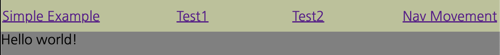

# container-breakpoints-react (demo)


## show to start

this is a normal vite app with very simple example components using React Router.

## install / run

```bash
pnpm install
pnpm run dev
```

## examples

when you run, you will see 4 links. 
choose each links


